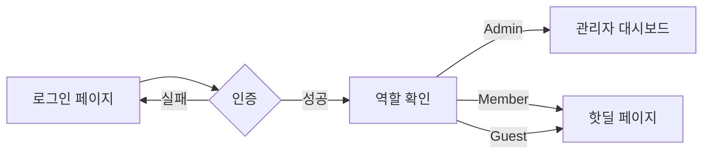
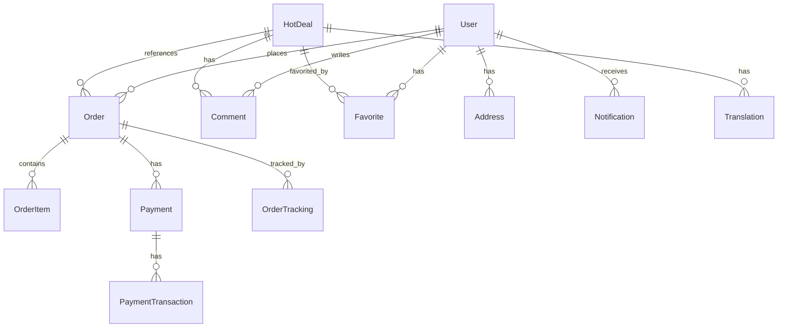

# HiKo 프론트엔드 구현 가이드 - DB 설계를 위한 상세 문서

## 목차

1. [서비스 개요](#1-서비스-개요)
2. [시스템 아키텍처](#2-시스템-아키텍처)
3. [사용자 타입 및 권한](#3-사용자-타입-및-권한)
4. [페이지별 상세 구현](#4-페이지별-상세-구현)
5. [데이터 모델 요구사항](#5-데이터-모델-요구사항)
6. [API 엔드포인트 요구사항](#6-api-엔드포인트-요구사항)
7. [실시간 기능 요구사항](#7-실시간-기능-요구사항)
8. [성능 및 확장성 고려사항](#8-성능-및-확장성-고려사항)

---

## 1. 서비스 개요

### 1.1 HiKo (하이코) 소개

HiKo는 한국 거주 외국인을 위한 종합 쇼핑 어시스턴트 플랫폼입니다.

**핵심 가치 제안:**
- 🔥 **실시간 핫딜 정보**: 6개 주요 한국 커뮤니티에서 24시간 크롤링
- 🌏 **다국어 지원**: 7개 언어로 자동 번역 (한국어, 영어, 중국어, 베트남어, 몽골어, 태국어, 일본어, 러시아어)
- 🛒 **대리구매 서비스**: 복잡한 한국 쇼핑몰 회원가입과 결제를 대행 (8% 수수료)

### 1.2 주요 기능

1. **핫딜 크롤링 시스템**
   - 6개 커뮤니티 실시간 모니터링 (뽐뿌, 루리웹, 클리앙, 퀘이사존, 쿨엔조이, 이토랜드)
   - 자동 중복 제거 및 카테고리 분류
   - 커뮤니티 추천수/댓글수 기반 인기도 산정

2. **다국어 번역 시스템**
   - 실시간 자동 번역
   - 번역 결과 캐싱 (성능 최적화)
   - 사용자 선호 언어 자동 감지

3. **대리구매 서비스 (Buy for Me)**
   - 6단계 프로세스: 요청 → 견적 → 승인 → 결제 → 구매 → 배송
   - 실시간 주문 추적
   - 다양한 결제 수단 지원

4. **사용자 기능**
   - 즐겨찾기 및 알림 설정
   - 검색 및 필터링
   - 댓글 및 커뮤니티 기능
   - 포인트/리워드 시스템

---

## 2. 시스템 아키텍처

### 2.1 기술 스택

**프론트엔드:**
- **Framework**: Next.js 15 (App Router)
- **UI Library**: React 18
- **스타일링**: Tailwind CSS
- **상태 관리**: Jotai (전역), TanStack Query (서버 상태)
- **폼 처리**: React Hook Form + Zod
- **UI 컴포넌트**: shadcn/ui
- **국제화**: 커스텀 i18n 시스템

**현재 데이터 레이어:**
- **임시 DB**: LocalStorage 기반 Repository 패턴
- **마이그레이션 준비**: Supabase로 전환 예정

### 2.2 아키텍처 패턴

```
┌─────────────────┐     ┌─────────────────┐     ┌─────────────────┐
│   Client Side   │     │   Server Side   │     │    Database     │
├─────────────────┤     ├─────────────────┤     ├─────────────────┤
│ - React Comps   │     │ - Server Comps  │     │ - Supabase      │
│ - Jotai State   │────▶│ - Server Actions│────▶│ - PostgreSQL    │
│ - TanStack Query│     │ - API Routes    │     │ - Realtime      │
│ - LocalStorage  │     │ - Middleware    │     │ - Storage       │
└─────────────────┘     └─────────────────┘     └─────────────────┘
```

### 2.3 데이터 플로우

1. **서버 컴포넌트**: 초기 데이터 페칭
2. **클라이언트 컴포넌트**: 인터랙티브 기능
3. **Server Actions**: 데이터 변경 작업
4. **TanStack Query**: 캐싱 및 동기화

---

## 3. 사용자 타입 및 권한

### 3.1 사용자 역할

| 역할 | 권한 | 주요 기능 |
|------|------|-----------|
| **Guest** | 기본 읽기 권한 | - 핫딜 조회<br>- 검색<br>- 언어 변경 |
| **Member** | 일반 사용자 권한 | - Guest 권한 모두<br>- 대리구매 신청<br>- 즐겨찾기<br>- 댓글 작성<br>- 주문 내역 조회 |
| **Admin** | 관리자 권한 | - 모든 권한<br>- 주문 관리<br>- 사용자 관리<br>- 핫딜 관리<br>- 통계 조회 |

### 3.2 인증 플로우



---

## 4. 페이지별 상세 구현

### 4.1 홈페이지 (/)

#### 목적
서비스 소개 및 주요 기능으로의 진입점 제공

#### PC 레이아웃
```
┌─────────────────────────────────────────────┐
│                   Header                     │
├─────────────────────────────────────────────┤
│        Hero Section (실시간 핫딜 수)         │
│     [핫딜 보기]  [무료 회원가입] 버튼        │
├─────────────────────────────────────────────┤
│   핵심 가치 카드 (3개 - 가로 배치)          │
├─────────────────────────────────────────────┤
│   6개 커뮤니티 소개 (3x2 그리드)            │
├─────────────────────────────────────────────┤
│   사용자 경로 분기 (2개 카드 - 가로)         │
│   [직접 구매 가능] | [대리구매 필요]         │
├─────────────────────────────────────────────┤
│         검색바 + 인기 카테고리 버튼          │
├─────────────────────────────────────────────┤
│      실시간 핫딜 미리보기 (그리드)           │
└─────────────────────────────────────────────┘
```

#### 모바일 레이아웃
```
┌─────────────────┐
│     Header      │
├─────────────────┤
│   Hero Section  │
│   (세로 중앙)    │
│  [버튼][버튼]    │
├─────────────────┤
│  핵심 가치 카드  │
│  (세로 스택)     │
├─────────────────┤
│  커뮤니티 소개   │
│  (1열 세로)      │
├─────────────────┤
│  경로 분기 카드  │
│  (세로 스택)     │
├─────────────────┤
│     검색바      │
│  카테고리 버튼   │
│  (가로 스크롤)   │
├─────────────────┤
│   핫딜 미리보기  │
│   (1열 세로)     │
└─────────────────┘
```

#### 필요 데이터
- **실시간 통계**: 활성 핫딜 수 (3일 이내)
- **핫딜 목록**: 최신 6-12개
- **카테고리 정보**: 인기 카테고리 목록

#### 사용자 인터랙션
1. 핫딜 보기 클릭 → /hotdeals 이동
2. 회원가입 클릭 → /register 이동
3. 검색 실행 → /search?q={query} 이동
4. 카테고리 클릭 → /hotdeals?category={category} 이동

---

### 4.2 핫딜 리스트 페이지 (/hotdeals)

#### 목적
모든 핫딜을 필터링/정렬하여 탐색

#### PC 레이아웃
```
┌─────────────────────────────────────────────┐
│                   Header                     │
├─────────────────────────────────────────────┤
│          페이지 제목 + 실시간 통계           │
├────────────┬────────────────────────────────┤
│            │                                │
│   필터     │      핫딜 카드 그리드          │
│   사이드바  │   (4-5열, 반응형 조정)         │
│            │                                │
│ - 카테고리  │   [카드][카드][카드][카드]     │
│ - 커뮤니티  │   [카드][카드][카드][카드]     │
│ - 가격범위  │   [카드][카드][카드][카드]     │
│ - 정렬옵션  │                                │
│ - 기타필터  │      페이지네이션 (하단)        │
│            │                                │
└────────────┴────────────────────────────────┘
```

#### 모바일 레이아웃
```
┌─────────────────┐
│     Header      │
├─────────────────┤
│   제목 + 통계   │
├─────────────────┤
│  필터 토글 버튼  │
│  (클릭시 확장)   │
├─────────────────┤
│                 │
│   핫딜 카드     │
│   (1-2열)       │
│                 │
│  [카드] [카드]   │
│  [카드] [카드]   │
│  [카드] [카드]   │
│                 │
├─────────────────┤
│  페이지네이션   │
└─────────────────┘
```

#### 필터 옵션 상세
```typescript
interface Filters {
  // 카테고리 필터
  categories: string[] // electronics, food, beauty, home, sports, books, travel, other
  
  // 커뮤니티 소스
  communitySources: string[] // ppomppu, ruliweb, clien, quasarzone, coolenjoy, itcm
  
  // 쇼핑몰
  shoppingSources: string[] // 쿠팡, 네이버, G마켓, 11번가, SSG 등
  
  // 가격 범위
  priceMin: number
  priceMax: number
  
  // 기타 옵션
  freeShipping: boolean // 무료배송만
  todayOnly: boolean // 오늘 등록된 것만
  
  // 정렬
  sort: 'latest' | 'price_low' | 'price_high' | 'popular'
  
  // 페이지네이션
  page: number
  itemsPerPage: 12
}
```

#### 핫딜 카드 구성 요소
```typescript
interface HotDealCard {
  // 상단 배지
  ranking?: number // 오늘의 순위
  isHot: boolean // HOT 라벨
  isPopular: boolean // 인기 라벨
  
  // 이미지
  thumbnailUrl: string
  
  // 정보
  title: string
  price: number
  originalPrice?: number
  discountRate?: number
  
  // 메타 정보
  source: string // 커뮤니티
  seller: string // 쇼핑몰
  
  // 통계
  viewCount: number
  likeCount: number
  commentCount: number
  
  // 시간
  timeAgo: string // "3시간 전"
  
  // 배송
  freeShipping: boolean
}
```

#### 필요 데이터
- **핫딜 목록**: 필터/정렬 적용된 결과
- **필터 옵션**: 가능한 카테고리, 커뮤니티, 쇼핑몰 목록
- **통계**: 전체 핫딜 수, 활성 핫딜 수

#### 사용자 인터랙션
1. 필터 선택 → URL 파라미터 업데이트 → 데이터 재조회
2. 정렬 변경 → 즉시 재정렬
3. 카드 클릭 → /hotdeals/{id} 상세 페이지
4. 페이지 변경 → 스크롤 상단 이동

---

### 4.3 핫딜 상세 페이지 (/hotdeals/[id])

#### 목적
핫딜 상세 정보 제공 및 대리구매 연결

#### PC 레이아웃
```
┌─────────────────────────────────────────────┐
│                   Header                     │
├─────────────────────────────────────────────┤
│              브레드크럼 네비게이션            │
├────────────────┬────────────────────────────┤
│                │                            │
│   상품 이미지   │      상품 정보              │
│   (고해상도)    │                            │
│                │  - 제목 (번역 토글)          │
│                │  - 가격 정보                │
│                │  - 할인율                   │
│                │  - 커뮤니티/쇼핑몰 정보      │
│                │  - 조회수/추천수            │
│                │  - 배송 정보                │
│                │                            │
│                │  [대리구매 신청] 버튼        │
│                │  [원본 사이트 방문] 버튼     │
│                │                            │
├────────────────┴────────────────────────────┤
│            상품 설명 (번역 가능)              │
├─────────────────────────────────────────────┤
│              댓글 섹션                       │
├─────────────────────────────────────────────┤
│            유사 상품 추천 (4개)               │
└─────────────────────────────────────────────┘
```

#### 모바일 레이아웃
```
┌─────────────────┐
│     Header      │
├─────────────────┤
│   브레드크럼    │
├─────────────────┤
│                 │
│   상품 이미지    │
│  (전체 너비)     │
│                 │
├─────────────────┤
│   상품 정보     │
│  - 제목         │
│  - 가격/할인    │
│  - 메타 정보    │
├─────────────────┤
│ [대리구매] 버튼  │
│ [원본사이트] 버튼│
├─────────────────┤
│   상품 설명     │
├─────────────────┤
│   댓글 섹션     │
├─────────────────┤
│  유사 상품 추천  │
│  (가로 스크롤)   │
└─────────────────┘
```

#### 대리구매 모달
```typescript
interface BuyForMeModal {
  // 상품 정보 (자동 입력)
  productInfo: {
    title: string
    price: number
    imageUrl: string
    originalUrl: string
    seller: string
  }
  
  // 사용자 입력
  quantity: number
  productOptions?: string // 색상, 사이즈 등
  
  // 배송 정보
  shippingAddress: {
    savedAddresses: Address[] // 저장된 주소 목록
    newAddress?: Address // 새 주소 입력
  }
  
  // 특별 요청사항
  specialRequests?: string
  
  // 예상 비용 계산
  estimatedCost: {
    productPrice: number
    quantity: number
    serviceFee: number // 8%
    estimatedTotal: number
  }
}
```

#### 필요 데이터
- **핫딜 상세**: 모든 필드 포함
- **번역 데이터**: 제목, 설명 번역
- **댓글 목록**: 페이지네이션
- **유사 상품**: 같은 카테고리 최신 4개
- **사용자 정보**: 로그인 시 저장된 주소

#### 사용자 인터랙션
1. 번역 토글 → 원문/번역 전환
2. 대리구매 클릭 → 모달 열기 → 폼 작성 → 제출
3. 원본 사이트 → 새 탭에서 열기
4. 댓글 작성 → 로그인 확인 → 등록
5. 유사 상품 클릭 → 해당 상세 페이지

---

### 4.4 대리구매 페이지 (/order)

#### 목적
URL 기반 또는 직접 상품 정보 입력으로 대리구매 신청

#### PC 레이아웃
```
┌─────────────────────────────────────────────┐
│                   Header                     │
├─────────────────────────────────────────────┤
│           서비스 소개 (아이콘 + 설명)         │
├─────────────────────────────────────────────┤
│                                             │
│            주문 폼 (중앙 정렬)               │
│                                             │
│  ┌─────────────────────────────────────┐   │
│  │        1. 상품 정보 입력              │   │
│  │  - URL 입력 (자동 파싱)              │   │
│  │  - 또는 직접 입력                    │   │
│  │  - 상품명, 가격, 수량, 옵션          │   │
│  │  - 상품 추가 (여러 개 가능)          │   │
│  ├─────────────────────────────────────┤   │
│  │        2. 배송 정보                  │   │
│  │  - 저장된 주소 선택                  │   │
│  │  - 새 주소 입력                      │   │
│  ├─────────────────────────────────────┤   │
│  │        3. 결제 방법                  │   │
│  │  - 카드/계좌이체 선택                │   │
│  ├─────────────────────────────────────┤   │
│  │        4. 비용 계산                  │   │
│  │  - 상품 총액                         │   │
│  │  - 서비스 수수료 (8%)               │   │
│  │  - 예상 총액                         │   │
│  └─────────────────────────────────────┘   │
│                                             │
│            [주문 신청] 버튼                  │
│                                             │
├─────────────────────────────────────────────┤
│         서비스 상세 안내 (프로세스)           │
└─────────────────────────────────────────────┘
```

#### 모바일 레이아웃
```
┌─────────────────┐
│     Header      │
├─────────────────┤
│  서비스 소개    │
│ (가로 스크롤)   │
├─────────────────┤
│                 │
│   주문 폼       │
│                 │
│ 1. 상품 정보    │
│ ─────────────   │
│ 2. 배송 정보    │
│ ─────────────   │
│ 3. 결제 방법    │
│ ─────────────   │
│ 4. 비용 계산    │
│                 │
├─────────────────┤
│ [주문 신청] 버튼 │
│  (하단 고정)     │
├─────────────────┤
│  서비스 안내    │
│  (아코디언)      │
└─────────────────┘
```

#### URL 파서 기능
```typescript
interface URLParser {
  // 지원 쇼핑몰
  supportedSites: [
    'coupang.com',
    'gmarket.co.kr',
    '11st.co.kr',
    'ssg.com',
    'naver.com',
    // ... 기타
  ]
  
  // 파싱 결과
  parseResult: {
    success: boolean
    data?: {
      productName: string
      price: number
      imageUrl?: string
      options?: string[]
    }
    error?: string
  }
}
```

#### 필요 데이터
- **사용자 주소**: 저장된 배송지 목록
- **결제 수단**: 사용 가능한 결제 방법
- **환율 정보**: 실시간 환율 (해외 결제 시)

#### 사용자 인터랙션
1. URL 입력 → 자동 파싱 → 정보 자동 채움
2. 직접 입력 → 각 필드 수동 입력
3. 상품 추가 → 여러 상품 동시 주문
4. 주소 선택/입력 → 유효성 검사
5. 비용 계산 → 실시간 업데이트
6. 주문 신청 → 확인 → DB 저장 → 주문 상세로 이동

---

### 4.5 마이페이지 (/mypage)

#### 목적
개인 정보 관리 및 주문 내역 확인

#### PC 레이아웃
```
┌─────────────────────────────────────────────┐
│                   Header                     │
├─────────────────────────────────────────────┤
│              프로필 정보 카드                 │
│         (아바타, 이름, 이메일, 등급)          │
├────────────┬────────────────────────────────┤
│            │                                │
│   메뉴     │          콘텐츠 영역            │
│            │                                │
│ - 주문내역  │    탭 콘텐츠 표시              │
│ - 프로필    │    (선택된 메뉴에 따라)         │
│ - 주소관리  │                                │
│ - 포인트    │                                │
│ - 설정     │                                │
│            │                                │
└────────────┴────────────────────────────────┘
```

#### 모바일 레이아웃
```
┌─────────────────┐
│     Header      │
├─────────────────┤
│   프로필 카드    │
├─────────────────┤
│   탭 메뉴       │
│ (가로 스크롤)   │
├─────────────────┤
│                 │
│   콘텐츠 영역    │
│                 │
│ 주문 내역 카드   │
│ ─────────────   │
│ 주문 내역 카드   │
│ ─────────────   │
│ 주문 내역 카드   │
│                 │
└─────────────────┘
```

#### 주문 내역 카드
```typescript
interface OrderCard {
  // 주문 정보
  orderNumber: string
  orderDate: Date
  
  // 상품 정보
  products: {
    name: string
    quantity: number
    price: number
  }[]
  
  // 상태
  status: OrderStatus
  statusColor: string
  canCancel: boolean // pending_review, quote_sent 상태만
  
  // 금액
  totalAmount: number
  
  // 액션
  actions: {
    viewDetail: boolean
    approveQuote?: boolean // quote_sent 상태
    makePayment?: boolean // payment_pending 상태
    trackShipping?: boolean // shipping 상태
  }
}
```

#### 필요 데이터
- **사용자 정보**: 프로필, 통계
- **주문 목록**: 상태별 필터링
- **주소 목록**: 배송지 관리
- **포인트 내역**: 적립/사용 이력

#### 사용자 인터랙션
1. 탭 전환 → 콘텐츠 변경
2. 주문 카드 클릭 → 주문 상세 페이지
3. 주문 취소 → 확인 모달 → 상태 변경
4. 주소 추가/수정/삭제 → 모달 → 저장
5. 프로필 수정 → 폼 → 업데이트

---

### 4.6 관리자 대시보드 (/admin)

#### 목적
서비스 운영 현황 모니터링 및 관리

#### PC 레이아웃
```
┌─────────────────────────────────────────────┐
│              Admin Header                    │
├────────────┬────────────────────────────────┤
│            │                                │
│            │         통계 카드 그리드         │
│            │   [사용자] [주문] [매출] [핫딜]  │
│   사이드    ├────────────────────────────────┤
│   메뉴     │                                │
│            │         차트 영역               │
│ - 대시보드  │   (매출 추이, 주문 현황)        │
│ - 주문관리  ├────────────────────────────────┤
│ - 사용자    │                                │
│ - 핫딜관리  │      최근 주문 테이블           │
│ - 설정     │   (실시간 업데이트)             │
│            │                                │
└────────────┴────────────────────────────────┘
```

#### 통계 카드
```typescript
interface DashboardStats {
  users: {
    total: number
    active: number // 7일 이내 로그인
    new: number // 오늘 가입
  }
  
  orders: {
    total: number
    pending: number
    processing: number
    completed: number
  }
  
  revenue: {
    today: number
    week: number
    month: number
    total: number
  }
  
  hotdeals: {
    total: number
    active: number
    expired: number
  }
}
```

#### 주문 관리 테이블
```typescript
interface AdminOrderTable {
  columns: [
    'orderNumber',
    'customer',
    'products',
    'status',
    'amount',
    'createdAt',
    'actions'
  ]
  
  filters: {
    status: OrderStatus[]
    dateRange: [Date, Date]
    search: string
  }
  
  actions: {
    viewDetail: boolean
    sendQuote: boolean // pending_review
    updateStatus: boolean
    addTracking: boolean
  }
}
```

#### 필요 데이터
- **실시간 통계**: 대시보드 지표
- **차트 데이터**: 시계열 매출/주문 데이터
- **주문 목록**: 필터/검색 적용
- **알림**: 새 주문, 긴급 처리 필요 항목

#### 사용자 인터랙션
1. 사이드바 메뉴 → 페이지 전환
2. 통계 카드 클릭 → 상세 페이지
3. 차트 호버 → 툴팁 표시
4. 주문 행 클릭 → 주문 상세 모달
5. 상태 변경 → 드롭다운 → 확인 → 업데이트
6. 실시간 업데이트 → 웹소켓/폴링

---

## 5. 데이터 모델 요구사항

### 5.1 핵심 엔티티 관계도



### 5.2 상세 스키마

#### Users 테이블
```sql
CREATE TABLE users (
  id UUID PRIMARY KEY DEFAULT gen_random_uuid(),
  email VARCHAR(255) UNIQUE NOT NULL,
  name VARCHAR(100) NOT NULL,
  role VARCHAR(20) DEFAULT 'member', -- guest, member, admin
  avatar_url TEXT,
  phone VARCHAR(20),
  preferred_language VARCHAR(10) DEFAULT 'ko',
  
  -- 통계
  total_orders INTEGER DEFAULT 0,
  total_spent DECIMAL(10, 2) DEFAULT 0,
  points INTEGER DEFAULT 0,
  
  -- 설정
  notification_settings JSONB DEFAULT '{}',
  
  -- 시간
  created_at TIMESTAMP WITH TIME ZONE DEFAULT NOW(),
  updated_at TIMESTAMP WITH TIME ZONE DEFAULT NOW(),
  last_login_at TIMESTAMP WITH TIME ZONE,
  
  -- 인덱스
  INDEX idx_users_email (email),
  INDEX idx_users_role (role),
  INDEX idx_users_created_at (created_at)
);
```

#### HotDeals 테이블
```sql
CREATE TABLE hotdeals (
  id UUID PRIMARY KEY DEFAULT gen_random_uuid(),
  
  -- 크롤링 정보
  title VARCHAR(500) NOT NULL,
  price DECIMAL(10, 2) NOT NULL, -- 0: 프로모션, -1: 가격다양
  original_price DECIMAL(10, 2),
  discount_rate INTEGER,
  
  -- 이미지 (CDN 최적화)
  thumbnail_url TEXT, -- 리스트용 저해상도
  image_url TEXT, -- 일반 해상도
  original_image_url TEXT, -- 고해상도
  
  -- 출처 정보
  original_url TEXT NOT NULL,
  seller VARCHAR(100), -- 쇼핑몰
  source VARCHAR(50) NOT NULL, -- 커뮤니티
  source_post_id VARCHAR(100) NOT NULL, -- 중복 체크용
  
  -- 커뮤니티 통계
  community_comment_count INTEGER DEFAULT 0,
  community_recommend_count INTEGER DEFAULT 0,
  is_popular BOOLEAN DEFAULT FALSE,
  is_hot BOOLEAN DEFAULT FALSE,
  
  -- 카테고리 및 태그
  category VARCHAR(50),
  tags TEXT[], -- PostgreSQL 배열
  
  -- 배송 정보
  shipping_info JSONB DEFAULT '{"isFree": false}',
  
  -- 상태
  status VARCHAR(20) DEFAULT 'active', -- active, ended
  
  -- 우리 사이트 통계
  view_count INTEGER DEFAULT 0,
  like_count INTEGER DEFAULT 0,
  comment_count INTEGER DEFAULT 0,
  order_count INTEGER DEFAULT 0,
  
  -- 시간
  crawled_at TIMESTAMP WITH TIME ZONE NOT NULL,
  created_at TIMESTAMP WITH TIME ZONE DEFAULT NOW(),
  updated_at TIMESTAMP WITH TIME ZONE DEFAULT NOW(),
  ended_at TIMESTAMP WITH TIME ZONE,
  
  -- 인덱스
  UNIQUE INDEX idx_hotdeals_source_post (source, source_post_id),
  INDEX idx_hotdeals_crawled_at (crawled_at DESC),
  INDEX idx_hotdeals_price (price),
  INDEX idx_hotdeals_category (category),
  INDEX idx_hotdeals_source (source),
  INDEX idx_hotdeals_seller (seller),
  INDEX idx_hotdeals_status (status),
  INDEX idx_hotdeals_is_hot (is_hot),
  INDEX idx_hotdeals_view_count (view_count DESC)
);
```

#### Orders 테이블 (대리구매)
```sql
CREATE TABLE orders (
  id UUID PRIMARY KEY DEFAULT gen_random_uuid(),
  order_number VARCHAR(20) UNIQUE NOT NULL, -- BFM-2024-0001
  user_id UUID REFERENCES users(id) NOT NULL,
  
  -- 상태
  status VARCHAR(30) NOT NULL, -- pending_review, quote_sent, etc.
  
  -- 상품 정보 (스냅샷)
  items JSONB NOT NULL, -- 주문 시점 상품 정보 보존
  
  -- 배송 정보
  shipping_address JSONB NOT NULL,
  
  -- 가격 정보
  subtotal DECIMAL(10, 2) NOT NULL,
  service_fee DECIMAL(10, 2) NOT NULL, -- 8%
  domestic_shipping_fee DECIMAL(10, 2) DEFAULT 0,
  total_amount DECIMAL(10, 2) NOT NULL,
  
  -- 견적 정보
  quote JSONB, -- 관리자가 작성한 견적
  
  -- 추적 정보
  korean_tracking_number VARCHAR(50),
  international_tracking_number VARCHAR(50),
  
  -- 메모
  customer_notes TEXT,
  admin_notes TEXT,
  
  -- 시간
  created_at TIMESTAMP WITH TIME ZONE DEFAULT NOW(),
  updated_at TIMESTAMP WITH TIME ZONE DEFAULT NOW(),
  quote_sent_at TIMESTAMP WITH TIME ZONE,
  quote_approved_at TIMESTAMP WITH TIME ZONE,
  paid_at TIMESTAMP WITH TIME ZONE,
  purchased_at TIMESTAMP WITH TIME ZONE,
  shipped_at TIMESTAMP WITH TIME ZONE,
  delivered_at TIMESTAMP WITH TIME ZONE,
  cancelled_at TIMESTAMP WITH TIME ZONE,
  
  -- 인덱스
  INDEX idx_orders_user_id (user_id),
  INDEX idx_orders_status (status),
  INDEX idx_orders_created_at (created_at DESC),
  INDEX idx_orders_order_number (order_number)
);
```

#### Translations 테이블
```sql
CREATE TABLE translations (
  id UUID PRIMARY KEY DEFAULT gen_random_uuid(),
  hotdeal_id UUID REFERENCES hotdeals(id) NOT NULL,
  language VARCHAR(10) NOT NULL,
  
  -- 번역 내용
  title TEXT NOT NULL,
  description TEXT,
  
  -- 상태
  status VARCHAR(20) DEFAULT 'completed',
  
  -- 캐싱
  cached_at TIMESTAMP WITH TIME ZONE DEFAULT NOW(),
  expires_at TIMESTAMP WITH TIME ZONE DEFAULT NOW() + INTERVAL '7 days',
  
  -- 에러 처리
  error TEXT,
  retry_count INTEGER DEFAULT 0,
  
  -- 인덱스
  UNIQUE INDEX idx_translations_hotdeal_lang (hotdeal_id, language),
  INDEX idx_translations_expires (expires_at),
  INDEX idx_translations_status (status)
);
```

#### Comments 테이블
```sql
CREATE TABLE comments (
  id UUID PRIMARY KEY DEFAULT gen_random_uuid(),
  user_id UUID REFERENCES users(id) NOT NULL,
  hotdeal_id UUID REFERENCES hotdeals(id),
  parent_id UUID REFERENCES comments(id), -- 대댓글
  
  -- 내용
  content TEXT NOT NULL,
  
  -- 상태
  is_deleted BOOLEAN DEFAULT FALSE,
  is_reported BOOLEAN DEFAULT FALSE,
  
  -- 통계
  like_count INTEGER DEFAULT 0,
  
  -- 시간
  created_at TIMESTAMP WITH TIME ZONE DEFAULT NOW(),
  updated_at TIMESTAMP WITH TIME ZONE DEFAULT NOW(),
  
  -- 인덱스
  INDEX idx_comments_hotdeal (hotdeal_id),
  INDEX idx_comments_user (user_id),
  INDEX idx_comments_parent (parent_id),
  INDEX idx_comments_created_at (created_at DESC)
);
```

#### Addresses 테이블
```sql
CREATE TABLE addresses (
  id UUID PRIMARY KEY DEFAULT gen_random_uuid(),
  user_id UUID REFERENCES users(id) NOT NULL,
  
  -- 주소 정보
  full_name VARCHAR(100) NOT NULL,
  phone_number VARCHAR(20) NOT NULL,
  email VARCHAR(255) NOT NULL,
  postal_code VARCHAR(10) NOT NULL,
  address_line1 VARCHAR(255) NOT NULL,
  address_line2 VARCHAR(255),
  
  -- 설정
  is_default BOOLEAN DEFAULT FALSE,
  label VARCHAR(50), -- 집, 회사 등
  
  -- 시간
  created_at TIMESTAMP WITH TIME ZONE DEFAULT NOW(),
  updated_at TIMESTAMP WITH TIME ZONE DEFAULT NOW(),
  
  -- 인덱스
  INDEX idx_addresses_user (user_id),
  INDEX idx_addresses_default (user_id, is_default)
);
```

### 5.3 인덱싱 전략

#### 읽기 최적화
- 핫딜 리스트: `crawled_at`, `category`, `source`, `price`
- 검색: Full-text search on `title`
- 통계: `view_count`, `like_count` for sorting

#### 쓰기 최적화
- 크롤링 중복 체크: `(source, source_post_id)` unique
- 번역 캐시: `(hotdeal_id, language)` unique

#### 복합 인덱스
```sql
-- 필터링 + 정렬
CREATE INDEX idx_hotdeals_filter_sort ON hotdeals(status, category, crawled_at DESC);

-- 사용자별 주문 조회
CREATE INDEX idx_orders_user_status ON orders(user_id, status, created_at DESC);
```

---

## 6. API 엔드포인트 요구사항

### 6.1 RESTful API 설계

#### 인증 관련
```typescript
// 로그인
POST /api/auth/login
Body: { email, password }
Response: { user, token }

// 회원가입
POST /api/auth/register
Body: { email, password, name, preferredLanguage }
Response: { user, token }

// 토큰 갱신
POST /api/auth/refresh
Header: Authorization: Bearer {refresh_token}
Response: { token, refreshToken }

// 로그아웃
POST /api/auth/logout
Header: Authorization: Bearer {token}
```

#### 핫딜 관련
```typescript
// 핫딜 목록
GET /api/hotdeals
Query: {
  page?: number
  limit?: number
  category?: string[]
  source?: string[]
  seller?: string[]
  priceMin?: number
  priceMax?: number
  freeShipping?: boolean
  sort?: 'latest' | 'price_low' | 'price_high' | 'popular'
}
Response: {
  data: HotDeal[]
  pagination: { page, limit, total, totalPages }
}

// 핫딜 상세
GET /api/hotdeals/:id
Response: HotDeal

// 핫딜 통계 업데이트
POST /api/hotdeals/:id/view
POST /api/hotdeals/:id/like
POST /api/hotdeals/:id/unlike

// 번역 조회
GET /api/hotdeals/:id/translations/:language
Response: Translation
```

#### 주문 관련
```typescript
// 주문 생성
POST /api/orders
Header: Authorization: Bearer {token}
Body: {
  items: OrderItem[]
  shippingAddress: ShippingAddress
  customerNotes?: string
}
Response: Order

// 주문 목록
GET /api/orders
Header: Authorization: Bearer {token}
Query: { status?, page?, limit? }
Response: { data: Order[], pagination }

// 주문 상세
GET /api/orders/:id
Header: Authorization: Bearer {token}
Response: Order

// 주문 취소
POST /api/orders/:id/cancel
Header: Authorization: Bearer {token}

// 견적 승인
POST /api/orders/:id/approve-quote
Header: Authorization: Bearer {token}
```

#### 관리자 전용
```typescript
// 대시보드 통계
GET /api/admin/stats
Header: Authorization: Bearer {admin_token}
Response: DashboardStats

// 주문 상태 변경
PUT /api/admin/orders/:id/status
Header: Authorization: Bearer {admin_token}
Body: { status, notes? }

// 견적 작성
POST /api/admin/orders/:id/quote
Header: Authorization: Bearer {admin_token}
Body: {
  finalProductPrice: number
  serviceFee: number
  domesticShippingFee: number
  totalAmount: number
  notes?: string
}
```

### 6.2 GraphQL 스키마 (선택사항)

```graphql
type Query {
  # 핫딜 조회
  hotdeals(
    filter: HotDealFilter
    sort: HotDealSort
    pagination: PaginationInput
  ): HotDealConnection!
  
  hotdeal(id: ID!): HotDeal
  
  # 사용자 정보
  me: User
  myOrders(
    status: OrderStatus
    pagination: PaginationInput
  ): OrderConnection!
}

type Mutation {
  # 인증
  login(email: String!, password: String!): AuthPayload!
  register(input: RegisterInput!): AuthPayload!
  
  # 주문
  createOrder(input: CreateOrderInput!): Order!
  cancelOrder(id: ID!): Order!
  
  # 핫딜 상호작용
  likeHotDeal(id: ID!): HotDeal!
  commentOnHotDeal(hotdealId: ID!, content: String!): Comment!
}

type Subscription {
  # 실시간 핫딜
  newHotDeals(category: String): HotDeal!
  
  # 주문 상태 변경
  orderStatusChanged(orderId: ID!): Order!
}
```

---

## 7. 실시간 기능 요구사항

### 7.1 WebSocket 이벤트

#### 클라이언트 → 서버
```typescript
// 구독
socket.emit('subscribe', {
  channels: ['hotdeals', 'orders:user123']
})

// 구독 해제
socket.emit('unsubscribe', {
  channels: ['hotdeals']
})
```

#### 서버 → 클라이언트
```typescript
// 새 핫딜
socket.on('hotdeal:new', (data: HotDeal) => {
  // 실시간 추가
})

// 핫딜 업데이트
socket.on('hotdeal:updated', (data: Partial<HotDeal>) => {
  // 상태 변경 (종료 등)
})

// 주문 상태 변경
socket.on('order:statusChanged', (data: {
  orderId: string
  status: OrderStatus
  timestamp: Date
}) => {
  // 알림 표시
})

// 새 댓글
socket.on('comment:new', (data: Comment) => {
  // 댓글 추가
})
```

### 7.2 실시간 업데이트 영역

1. **핫딜 리스트**
   - 새 핫딜 추가
   - 핫딜 종료
   - 조회수/추천수 변경

2. **관리자 대시보드**
   - 실시간 통계
   - 새 주문 알림
   - 긴급 처리 알림

3. **주문 추적**
   - 상태 변경 알림
   - 견적 도착 알림
   - 배송 업데이트

4. **알림 센터**
   - 즐겨찾기 핫딜 알림
   - 댓글 답글 알림
   - 시스템 공지

---

## 8. 성능 및 확장성 고려사항

### 8.1 캐싱 전략

#### CDN 캐싱
- 정적 자산: 1년
- 이미지: 7일 (외부 이미지)
- API 응답: 상황별 설정

#### 애플리케이션 캐싱
```typescript
// Redis 캐시 키 설계
const cacheKeys = {
  // 핫딜 목록 (5분)
  hotdealsList: `hotdeals:list:${filters}:${page}`,
  
  // 핫딜 상세 (10분)
  hotdealDetail: `hotdeals:detail:${id}`,
  
  // 번역 (7일)
  translation: `translations:${hotdealId}:${language}`,
  
  // 사용자 세션
  userSession: `sessions:${userId}`,
  
  // 통계 (1분)
  dashboardStats: `stats:dashboard:${date}`
}
```

### 8.2 데이터베이스 최적화

#### 파티셔닝
```sql
-- 핫딜 테이블 월별 파티셔닝
CREATE TABLE hotdeals_2024_01 PARTITION OF hotdeals
FOR VALUES FROM ('2024-01-01') TO ('2024-02-01');

-- 자동 파티션 생성 함수
CREATE OR REPLACE FUNCTION create_monthly_partitions()
RETURNS void AS $$
-- 구현
$$ LANGUAGE plpgsql;
```

#### 읽기 복제
- Master: 쓰기 작업
- Replica: 읽기 작업 분산
- 지연 시간 모니터링

### 8.3 이미지 최적화

#### 이미지 처리 파이프라인
```typescript
// 이미지 변환 규칙
const imagePresets = {
  thumbnail: {
    width: 200,
    height: 200,
    quality: 85,
    format: 'webp'
  },
  card: {
    width: 400,
    height: 400,
    quality: 90,
    format: 'webp'
  },
  detail: {
    width: 800,
    height: 800,
    quality: 95,
    format: 'webp'
  }
}

// CDN URL 생성
function getCDNUrl(originalUrl: string, preset: string) {
  return `https://cdn.hiko.kr/transform/${preset}/${encodeURIComponent(originalUrl)}`
}
```

### 8.4 검색 최적화

#### Elasticsearch 인덱스
```json
{
  "mappings": {
    "properties": {
      "title": {
        "type": "text",
        "analyzer": "korean",
        "fields": {
          "keyword": { "type": "keyword" }
        }
      },
      "title_en": { "type": "text", "analyzer": "english" },
      "title_zh": { "type": "text", "analyzer": "chinese" },
      "category": { "type": "keyword" },
      "price": { "type": "float" },
      "crawled_at": { "type": "date" }
    }
  }
}
```

### 8.5 모니터링 및 알림

#### 핵심 지표
1. **응답 시간**: P50, P95, P99
2. **에러율**: 4xx, 5xx
3. **처리량**: RPS (Requests Per Second)
4. **리소스**: CPU, Memory, DB Connections

#### 알림 규칙
```yaml
alerts:
  - name: high_error_rate
    condition: error_rate > 1%
    duration: 5m
    severity: critical
    
  - name: slow_response
    condition: p95_latency > 1s
    duration: 10m
    severity: warning
    
  - name: low_disk_space
    condition: disk_usage > 80%
    severity: warning
```

---

## 맺음말

이 문서는 HiKo 서비스의 프론트엔드 구현 전체를 상세히 설명하여, DB 설계 담당자가 효과적인 데이터베이스 스키마를 설계할 수 있도록 작성되었습니다.

주요 고려사항:
1. **확장성**: 사용자와 데이터 증가에 대비
2. **성능**: 빠른 응답 시간과 효율적인 쿼리
3. **유연성**: 새로운 기능 추가 용이
4. **안정성**: 데이터 무결성과 백업

추가 질문이나 명확히 해야 할 부분이 있다면 언제든 문의해 주세요.