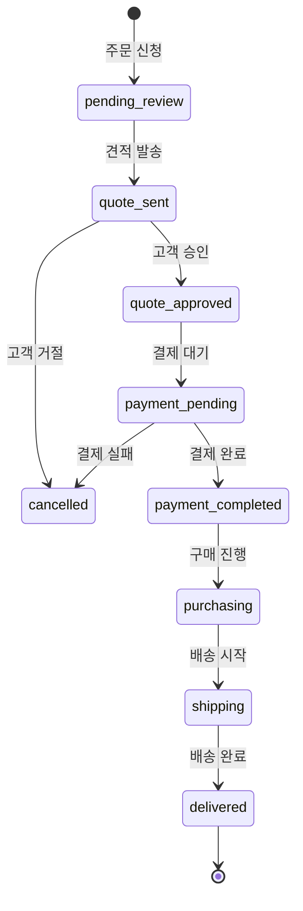

# HiKo 사용자 플로우 및 인터랙션 가이드

## 1. 일반 사용자 (Guest/Member) 플로우

### 1.1 첫 방문자 여정 (Guest)

#### 시나리오: 핫딜 탐색 및 회원가입
```
1. 홈페이지 진입
   ↓
2. 실시간 핫딜 확인
   ↓
3. "핫딜 보기" 클릭
   ↓
4. 핫딜 리스트 브라우징
   ↓
5. 관심 상품 클릭
   ↓
6. 상세 페이지 확인
   ↓
7. "대리구매 신청" 클릭
   ↓
8. 로그인 요구 → 회원가입
   ↓
9. 회원가입 완료
   ↓
10. 대리구매 진행
```

#### 상세 인터랙션

**1. 홈페이지 진입**
- 언어 자동 감지 (브라우저 설정 기반)
- 실시간 핫딜 수 애니메이션 표시
- 히어로 섹션 자동 슬라이드

**2. 핫딜 리스트 탐색**
- 무한 스크롤 또는 페이지네이션
- 필터 적용 시 URL 파라미터 업데이트
- 정렬 변경 시 즉시 재정렬 (로딩 없이)

**3. 필터링 인터랙션**
```typescript
// PC: 사이드바 고정
- 체크박스 클릭 → 즉시 적용
- 가격 슬라이더 → 드래그 종료 시 적용
- 초기화 버튼 → 모든 필터 해제

// 모바일: 바텀 시트
- 필터 버튼 클릭 → 바텀 시트 열림
- 필터 선택 → "적용" 버튼 클릭
- 뒤로가기 제스처 → 바텀 시트 닫기
```

**4. 핫딜 카드 호버 효과 (PC)**
```css
- 그림자 확대
- 살짝 위로 이동 (translateY: -4px)
- 이미지 줌 효과 (scale: 1.05)
- 추가 정보 표시 (판매처, 배송비)
```

### 1.2 회원 주요 플로우

#### 시나리오 A: 대리구매 신청
```
1. 핫딜 상세 페이지
   ↓
2. "대리구매 신청" 버튼 클릭
   ↓
3. 모달 창 열림
   ├─ 상품 정보 자동 입력
   ├─ 수량 선택
   ├─ 옵션 입력 (색상, 사이즈 등)
   └─ 배송지 선택/입력
   ↓
4. 예상 비용 실시간 계산
   ↓
5. "신청하기" 클릭
   ↓
6. 확인 모달
   ↓
7. 주문 상세 페이지로 이동
```

**모달 인터랙션 상세**
```typescript
interface BuyForMeModalInteraction {
  // 수량 변경
  onQuantityChange: (value: number) => {
    // 실시간 가격 재계산
    updateEstimatedCost()
    // 재고 확인 (있다면)
    checkAvailability()
  }
  
  // 주소 선택
  onAddressSelect: (addressId: string) => {
    // 선택된 주소 하이라이트
    // 배송비 예상 (국가별)
    estimateShipping()
  }
  
  // 새 주소 추가
  onNewAddress: () => {
    // 주소 검색 API 호출
    // 유효성 검사
    // 저장 옵션 제공
  }
}
```

#### 시나리오 B: URL로 직접 주문
```
1. /order 페이지 접속
   ↓
2. URL 입력
   ↓
3. "가져오기" 클릭
   ↓
4. 로딩 스피너 (1-3초)
   ↓
5. 파싱 결과 자동 입력
   ├─ 성공: 상품 정보 표시
   └─ 실패: 수동 입력 안내
   ↓
6. 추가 정보 입력
   ↓
7. 주문 제출
```

**URL 파서 피드백**
```typescript
// 성공 케이스
{
  status: "success",
  message: "상품 정보를 가져왔습니다",
  animation: "체크 아이콘 + 초록색 배경"
}

// 실패 케이스
{
  status: "error",
  message: "해당 사이트는 아직 지원하지 않습니다",
  suggestion: "직접 입력해 주세요",
  animation: "X 아이콘 + 빨간색 배경"
}

// 부분 성공
{
  status: "partial",
  message: "일부 정보만 가져왔습니다",
  missing: ["가격", "옵션"],
  animation: "느낌표 아이콘 + 노란색 배경"
}
```

### 1.3 검색 플로우

#### 검색 자동완성
```typescript
interface SearchInteraction {
  // 입력 시작 (3글자 이상)
  onInput: (query: string) => {
    if (query.length >= 3) {
      // 300ms 디바운싱
      debounce(() => {
        fetchSuggestions(query)
      }, 300)
    }
  }
  
  // 자동완성 표시
  suggestions: {
    recent: string[]      // 최근 검색어
    popular: string[]     // 인기 검색어
    products: HotDeal[]   // 상품 미리보기
  }
  
  // 키보드 네비게이션
  keyboard: {
    ArrowDown: "다음 항목",
    ArrowUp: "이전 항목",
    Enter: "선택",
    Escape: "닫기"
  }
}
```

### 1.4 즐겨찾기 및 알림

#### 즐겨찾기 토글
```typescript
// 하트 아이콘 애니메이션
const toggleFavorite = async (hotdealId: string) => {
  // 1. 즉시 UI 업데이트 (Optimistic UI)
  setIsFavorited(!isFavorited)
  
  // 2. 하트 애니메이션
  if (!isFavorited) {
    // 채워지는 애니메이션
    animateHeart("fill", { 
      duration: 300,
      easing: "ease-out",
      scale: [1, 1.2, 1]
    })
  } else {
    // 비워지는 애니메이션
    animateHeart("empty", {
      duration: 200,
      easing: "ease-in"
    })
  }
  
  // 3. API 호출
  try {
    await api.toggleFavorite(hotdealId)
  } catch (error) {
    // 4. 실패 시 롤백
    setIsFavorited(isFavorited)
    showToast("오류가 발생했습니다")
  }
}
```

## 2. 주문 진행 상태별 인터랙션

### 2.1 주문 상태 변화 플로우



### 2.2 상태별 사용자 액션

#### pending_review (검토 대기)
```typescript
{
  userActions: {
    view: true,           // 주문 상세 보기
    cancel: true,         // 주문 취소
    modify: true,         // 수정 요청
    message: true         // 메시지 남기기
  },
  
  notifications: [
    "주문이 접수되었습니다",
    "24시간 내 견적서를 보내드립니다"
  ],
  
  ui: {
    statusColor: "yellow",
    icon: "clock",
    progressBar: 10
  }
}
```

#### quote_sent (견적 발송)
```typescript
{
  userActions: {
    view: true,
    approve: true,        // 견적 승인
    reject: true,         // 견적 거절
    negotiate: true,      // 재협상 요청
    download: true        // 견적서 다운로드
  },
  
  modal: {
    title: "견적서가 도착했습니다",
    content: QuoteDetails,
    actions: [
      { label: "승인", style: "primary", action: "approve" },
      { label: "거절", style: "danger", action: "reject" },
      { label: "문의", style: "default", action: "message" }
    ]
  }
}
```

### 2.3 실시간 알림 시스템

#### 알림 유형 및 표시 방법
```typescript
interface NotificationSystem {
  // 브라우저 알림
  browser: {
    permission: "granted" | "denied" | "default",
    trigger: ["quote_sent", "shipping", "delivered"],
    format: {
      title: "HiKo 알림",
      body: string,
      icon: "/logo.png",
      badge: "/badge.png"
    }
  },
  
  // 인앱 알림
  inApp: {
    toast: {
      position: "top-right",
      duration: 5000,
      style: "slide-in"
    },
    
    bell: {
      badge: number,        // 읽지 않은 알림 수
      animation: "shake",   // 새 알림 시 흔들림
      dropdown: {
        maxHeight: 400,
        items: Notification[]
      }
    }
  },
  
  // 이메일 알림
  email: {
    trigger: ["quote_sent", "payment_completed", "delivered"],
    template: "order-status-change"
  }
}
```

## 3. 모바일 특화 인터랙션

### 3.1 터치 제스처

#### 스와이프 동작
```typescript
interface SwipeGestures {
  // 핫딜 카드 스와이프
  hotdealCard: {
    left: "즐겨찾기 추가",
    right: "공유하기",
    threshold: 75,  // px
    animation: "spring"
  },
  
  // 이미지 갤러리
  imageGallery: {
    horizontal: "이미지 전환",
    pinch: "확대/축소",
    doubleTap: "원본 크기 토글"
  },
  
  // 바텀 시트
  bottomSheet: {
    down: "닫기",
    up: "전체 화면",
    threshold: 0.3  // 화면 비율
  }
}
```

### 3.2 하단 고정 버튼

#### 컨텍스트별 CTA
```typescript
// 핫딜 상세 페이지
<FixedBottomCTA>
  <Button primary>대리구매 신청</Button>
  <Button secondary>
    <Heart /> 즐겨찾기
  </Button>
</FixedBottomCTA>

// 주문 폼 페이지
<FixedBottomCTA>
  <div>예상 금액: ₩{total}</div>
  <Button primary disabled={!isValid}>
    주문하기
  </Button>
</FixedBottomCTA>

// 스크롤 시 동작
onScroll = () => {
  if (scrollDirection === "down") {
    hideBottomCTA({ animation: "slide-down" })
  } else {
    showBottomCTA({ animation: "slide-up" })
  }
}
```

### 3.3 모바일 최적화 폼

#### 단계별 폼 (Step Form)
```typescript
interface MobileOrderForm {
  steps: [
    {
      title: "상품 정보",
      fields: ["url", "name", "price", "quantity"],
      validation: "onChange"
    },
    {
      title: "배송 정보",
      fields: ["address", "phone", "email"],
      validation: "onBlur"
    },
    {
      title: "결제 방법",
      fields: ["paymentMethod"],
      validation: "onSubmit"
    },
    {
      title: "확인",
      type: "summary",
      editable: true
    }
  ],
  
  navigation: {
    back: "swipe-right" | "button",
    next: "button-only",  // 실수 방지
    progress: "dots" | "bar"
  }
}
```

## 4. 성능 최적화 인터랙션

### 4.1 로딩 상태 관리

#### 스켈레톤 UI
```typescript
// 핫딜 카드 스켈레톤
<HotDealSkeleton>
  <div className="animate-pulse">
    <div className="h-48 bg-gray-200 rounded" />  {/* 이미지 */}
    <div className="mt-2 h-4 bg-gray-200 rounded w-3/4" />  {/* 제목 */}
    <div className="mt-1 h-4 bg-gray-200 rounded w-1/2" />  {/* 가격 */}
  </div>
</HotDealSkeleton>

// 점진적 로딩
const ProgressiveLoad = () => {
  // 1단계: 스켈레톤
  if (loading) return <Skeleton />
  
  // 2단계: 기본 정보
  if (data && !details) return <BasicInfo />
  
  // 3단계: 전체 정보
  return <FullContent />
}
```

### 4.2 이미지 최적화

#### 레이지 로딩
```typescript
interface ImageOptimization {
  // Intersection Observer
  lazyLoad: {
    rootMargin: "50px",  // 50px 전에 로드 시작
    threshold: 0.01
  },
  
  // 프로그레시브 로딩
  progressive: {
    placeholder: "blur",  // 블러 처리된 저화질
    stages: [
      { quality: 10, size: "10%" },   // 초저화질
      { quality: 50, size: "50%" },   // 중간화질
      { quality: 90, size: "100%" }   // 고화질
    ]
  },
  
  // 에러 처리
  fallback: {
    error: "/images/no-image.png",
    loading: "/images/loading.gif"
  }
}
```

## 5. 접근성 고려사항

### 5.1 키보드 네비게이션

```typescript
interface KeyboardNavigation {
  // 탭 순서
  tabOrder: {
    header: 1,
    mainNav: 2,
    searchBar: 3,
    filters: 4,
    content: 5,
    footer: 6
  },
  
  // 단축키
  shortcuts: {
    "/": "검색창 포커스",
    "g h": "홈으로 이동",
    "g d": "핫딜 목록",
    "g o": "주문 페이지",
    "?": "단축키 도움말"
  },
  
  // 포커스 트랩 (모달)
  focusTrap: {
    firstElement: ".modal-close",
    lastElement: ".modal-confirm",
    escape: "closeModal"
  }
}
```

### 5.2 스크린 리더 지원

```typescript
// ARIA 라벨
<button 
  aria-label="즐겨찾기에 추가"
  aria-pressed={isFavorited}
  onClick={toggleFavorite}
>
  <Heart aria-hidden="true" />
</button>

// 실시간 알림
<div 
  role="status" 
  aria-live="polite" 
  aria-atomic="true"
>
  {notification.message}
</div>

// 로딩 상태
<div role="status" aria-busy="true">
  <span className="sr-only">로딩 중...</span>
  <Spinner />
</div>
```

## 6. 에러 처리 및 복구

### 6.1 네트워크 에러

```typescript
interface ErrorRecovery {
  // 자동 재시도
  retry: {
    attempts: 3,
    delay: [1000, 2000, 4000],  // 지수 백오프
    retryable: [408, 429, 500, 502, 503, 504]
  },
  
  // 오프라인 모드
  offline: {
    detection: "navigator.onLine",
    fallback: "cached-data",
    queue: "pending-requests",
    notification: "오프라인 상태입니다"
  },
  
  // 사용자 피드백
  userFeedback: {
    toast: {
      error: "빨간색 배경",
      warning: "노란색 배경",
      info: "파란색 배경"
    },
    
    actions: [
      { label: "다시 시도", action: "retry" },
      { label: "문의하기", action: "support" }
    ]
  }
}
```

### 6.2 폼 유효성 검사

```typescript
interface FormValidation {
  // 실시간 검증
  realtime: {
    email: {
      pattern: /^[^\s@]+@[^\s@]+\.[^\s@]+$/,
      message: "올바른 이메일 형식이 아닙니다",
      showAfter: "blur"
    },
    
    phone: {
      pattern: /^01[0-9]-?[0-9]{3,4}-?[0-9]{4}$/,
      message: "올바른 전화번호 형식이 아닙니다",
      showAfter: "blur",
      autoFormat: true  // 자동 하이픈 추가
    }
  },
  
  // 전체 검증
  onSubmit: {
    showAllErrors: true,
    scrollToFirst: true,
    focusFirst: true
  }
}
```

이 문서는 사용자가 HiKo 서비스를 이용하면서 경험하는 모든 인터랙션을 상세히 기술하여, DB 설계 시 필요한 상태 관리와 데이터 요구사항을 명확히 이해할 수 있도록 작성되었습니다.