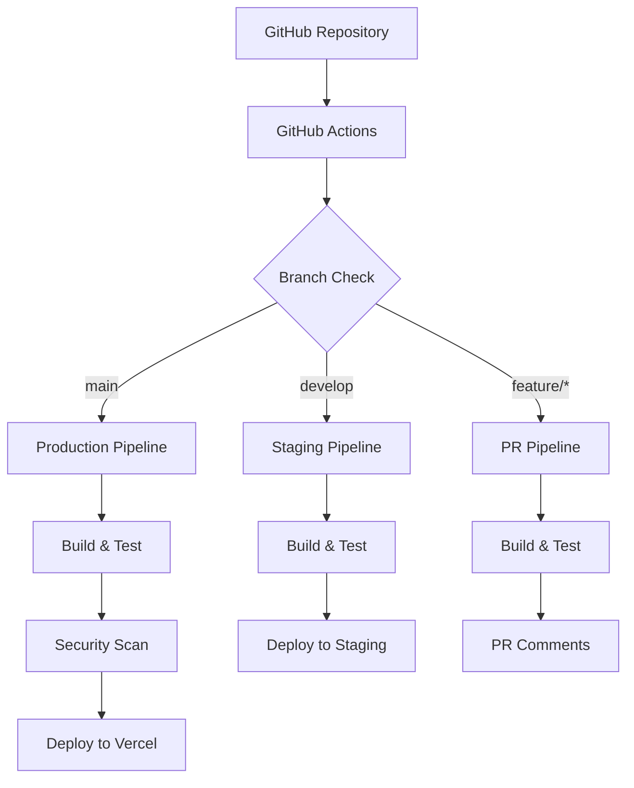

# HiKo 프로젝트 CI/CD 구현 최종 계획서

## 📋 **개요**

**문서 목적**: HiKo 쇼핑 도우미 플랫폼을 위한 최적화된 CI/CD 파이프라인 구축 계획  
**작성일**: 2025-08-06  
**프로젝트 현황**: 75% 완료, TypeScript 오류 4개 해결 후 배포 가능  
**기술 스택**: Next.js 15.3.5 + React 19 + Supabase + Clerk + pnpm

---

## 🔍 **현재 상태 분석**

### ✅ **완료된 영역들**
- **Supabase 마이그레이션**: 100% 완료 (LocalStorage → Supabase)
- **크롤링 시스템**: 6개 커뮤니티 크롤러 구현 완료
- **Next.js 15 아키텍처**: App Router 완벽 적용
- **ESLint**: 0개 오류 상태
- **프로덕션 빌드**: 52페이지 4초 빌드 성공

### 🚨 **해결 필요한 이슈들**
1. **CI/CD 파이프라인**: 전혀 없음 ❌
2. **TypeScript 오류**: 4개 (프로덕션 배포 차단) 🚨
3. **테스트 커버리지**: 5% 미만 (심각한 수준) ⚠️
4. **자동 배포**: 수동 프로세스만 존재

### 📊 **기술 요구사항**
```yaml
핵심_기술_스택:
  frontend: "Next.js 15.3.5 + React 19"
  backend: "Supabase (Database + Auth)"
  auth: "Clerk Authentication"
  package_manager: "pnpm"
  deployment: "Vercel (권장)"
  testing: "Vitest (unit) + Playwright (e2e)"

특수_요구사항:
  crawler_system: "6개 한국 커뮤니티 크롤링"
  multilingual: "7개 언어 지원 (EN,ZH,VI,MN,TH,JA,RU)"
  realtime: "Supabase Realtime 구독"
  commission: "8% 수수료 대리구매 서비스"
```

---

## 🎯 **CI/CD 구현 전략**

### 🏗️ **아키텍처 개요**


### 🔧 **단계별 구현 계획**

#### **Phase 1: 긴급 수정 (1-2시간)** 🚨
**목표**: 배포 차단 요소 제거

```yaml
우선순위: Critical
소요시간: 1-2시간
작업내용:
  - TypeScript 오류 4개 수정
    - app/admin/hotdeal-manager/page.tsx:247 (타입 매핑)
    - lib/crawlers 3개 파일 (접근 제한자)
  - 검증: pnpm tsc --noEmit → 0개 오류
목표: 즉시 프로덕션 배포 가능한 상태
```

#### **Phase 2: 기본 CI/CD 구축 (1일)** ⚡
**목표**: 기본 자동화 파이프라인 구축

**2.1 GitHub Actions 워크플로우 생성**
```yaml
# .github/workflows/ci-cd.yml
name: HiKo CI/CD Pipeline
on:
  push:
    branches: [main, develop]
  pull_request:
    branches: [main]

jobs:
  test:
    runs-on: ubuntu-latest
    steps:
      - uses: actions/checkout@v4
      - uses: pnpm/action-setup@v2
        with:
          version: latest
      - uses: actions/setup-node@v4
        with:
          node-version: '20'
          cache: 'pnpm'
      
      # Next.js 빌드 캐시 최적화
      - uses: actions/cache@v4
        with:
          path: |
            ~/.npm
            ${{ github.workspace }}/.next/cache
          key: ${{ runner.os }}-nextjs-${{ hashFiles('**/pnpm-lock.yaml') }}-${{ hashFiles('**/*.js', '**/*.jsx', '**/*.ts', '**/*.tsx') }}
          restore-keys: |
            ${{ runner.os }}-nextjs-${{ hashFiles('**/pnpm-lock.yaml') }}-
      
      - run: pnpm install --frozen-lockfile
      - run: pnpm lint
      - run: pnpm tsc --noEmit
      - run: pnpm test:unit
      - run: pnpm build
```

**2.2 Vercel 자동 배포 설정**
```yaml
vercel_configuration:
  production: 
    branch: main
    domain: "hiko.kr"
  staging:
    branch: develop  
    domain: "staging.hiko.kr"
  pr_previews: 자동 생성
```

#### **Phase 3: 테스트 강화 (1-2주)** 🧪
**목표**: 5% → 60% 테스트 커버리지 달성

**3.1 단위 테스트 확대**
```yaml
핵심_컴포넌트_테스트:
  - hotdeal-card: 핫딜 카드 렌더링
  - order-form: 주문 폼 검증
  - payment-history: 결제 내역
  - favorite-button: 찜하기 기능
  - address-management: 주소 관리

크롤러_테스트:
  - ppomppu-crawler: 기존 완료
  - ruliweb-crawler: 신규 추가
  - clien-crawler: 신규 추가
  - quasarzone-crawler: 신규 추가
```

**3.2 E2E 테스트 구축**
```typescript
// tests/e2e/critical-flows.spec.ts
test('핫딜 검색부터 주문까지 전체 플로우', async ({ page }) => {
  await page.goto('/hotdeals')
  await page.fill('[data-testid=search]', '노트북')
  await page.click('[data-testid=search-button]')
  
  // 첫 번째 결과 클릭
  await page.click('[data-testid=hotdeal-item]:first-child')
  
  // 주문하기 버튼 클릭
  await page.click('[data-testid=order-button]')
  
  // 주문 폼 작성
  await page.fill('[data-testid=quantity]', '1')
  await page.click('[data-testid=submit-order]')
  
  // 주문 완료 확인
  await expect(page.locator('[data-testid=order-success]')).toBeVisible()
})
```

#### **Phase 4: 보안 & 품질 강화 (3-5일)** 🛡️
**목표**: 프로덕션 수준 보안 및 품질 보장

**4.1 보안 검사 통합**
```yaml
security_scanning:
  dependency_check: 
    - npm audit
    - Snyk vulnerability scan
  code_analysis:
    - ESLint security rules
    - CodeQL analysis (GitHub Advanced Security)
  environment_security:
    - Environment variable validation
    - API key rotation check
```

**4.2 코드 품질 게이트**
```yaml
quality_gates:
  - ESLint: 0 오류, 0 경고
  - TypeScript: strict mode 통과
  - Test Coverage: ≥60% (unit), ≥70% (integration)
  - Bundle Size: ≤2MB 총 크기
  - Lighthouse Score: ≥90 (Performance, SEO)
```

#### **Phase 5: 고급 최적화 (1주일)** 🚀
**목표**: 성능 및 개발자 경험 최적화

**5.1 성능 모니터링**
```yaml
performance_monitoring:
  - Bundle analysis: 자동 번들 크기 추적
  - Lighthouse CI: 자동 성능 점수 측정
  - Core Web Vitals: LCP, FID, CLS 추적
  - Real User Monitoring: Vercel Analytics
```

**5.2 개발자 경험 향상**
```yaml
developer_experience:
  - PR Preview: 모든 PR에 자동 배포 URL
  - Visual Regression: Chromatic 또는 자체 구축
  - Slack/Discord 알림: 배포 상태 알림
  - 자동 의존성 업데이트: Dependabot
```

---

## 📂 **워크플로우 파일 구조**

### **`.github/workflows/` 디렉토리 구성**
```
.github/workflows/
├── ci.yml              # 기본 CI (lint, test, build)
├── deploy-production.yml   # 프로덕션 배포
├── deploy-staging.yml     # 스테이징 배포
├── security.yml          # 보안 검사
├── performance.yml        # 성능 테스트
└── dependency-update.yml  # 의존성 업데이트
```

### **핵심 워크플로우: `ci.yml`**
```yaml
name: Continuous Integration

on:
  push:
    branches: [main, develop]
  pull_request:
    branches: [main, develop]

env:
  NEXT_TELEMETRY_DISABLED: 1

jobs:
  lint-and-type-check:
    name: Lint and Type Check
    runs-on: ubuntu-latest
    steps:
      - name: Checkout code
        uses: actions/checkout@v4
        
      - name: Setup pnpm
        uses: pnpm/action-setup@v2
        with:
          version: latest
          
      - name: Setup Node.js
        uses: actions/setup-node@v4
        with:
          node-version: '20'
          cache: 'pnpm'
          
      - name: Install dependencies
        run: pnpm install --frozen-lockfile
        
      - name: Lint
        run: pnpm lint
        
      - name: Type check
        run: pnpm tsc --noEmit

  test:
    name: Unit Tests
    runs-on: ubuntu-latest
    needs: lint-and-type-check
    steps:
      - name: Checkout code
        uses: actions/checkout@v4
        
      - name: Setup pnpm
        uses: pnpm/action-setup@v2
        with:
          version: latest
          
      - name: Setup Node.js
        uses: actions/setup-node@v4
        with:
          node-version: '20'
          cache: 'pnpm'
          
      - name: Install dependencies
        run: pnpm install --frozen-lockfile
        
      - name: Run unit tests
        run: pnpm test:unit
        
      - name: Upload coverage
        uses: codecov/codecov-action@v3

  e2e-test:
    name: E2E Tests
    runs-on: ubuntu-latest
    needs: test
    steps:
      - name: Checkout code
        uses: actions/checkout@v4
        
      - name: Setup pnpm
        uses: pnpm/action-setup@v2
        with:
          version: latest
          
      - name: Setup Node.js
        uses: actions/setup-node@v4
        with:
          node-version: '20'
          cache: 'pnpm'
          
      - name: Install dependencies
        run: pnpm install --frozen-lockfile
        
      - name: Install Playwright browsers
        run: pnpm exec playwright install --with-deps
        
      - name: Build application
        run: pnpm build
        env:
          NEXT_PUBLIC_SUPABASE_URL: ${{ secrets.NEXT_PUBLIC_SUPABASE_URL }}
          NEXT_PUBLIC_SUPABASE_ANON_KEY: ${{ secrets.NEXT_PUBLIC_SUPABASE_ANON_KEY }}
          NEXT_PUBLIC_CLERK_PUBLISHABLE_KEY: ${{ secrets.NEXT_PUBLIC_CLERK_PUBLISHABLE_KEY }}
          
      - name: Run E2E tests
        run: pnpm test:e2e
        
      - name: Upload test results
        uses: actions/upload-artifact@v3
        if: failure()
        with:
          name: playwright-report
          path: playwright-report/

  build:
    name: Build Application
    runs-on: ubuntu-latest
    needs: [lint-and-type-check, test]
    steps:
      - name: Checkout code
        uses: actions/checkout@v4
        
      - name: Setup pnpm
        uses: pnpm/action-setup@v2
        with:
          version: latest
          
      - name: Setup Node.js
        uses: actions/setup-node@v4
        with:
          node-version: '20'
          cache: 'pnpm'
          
      - name: Cache Next.js build
        uses: actions/cache@v4
        with:
          path: |
            ~/.npm
            ${{ github.workspace }}/.next/cache
          key: ${{ runner.os }}-nextjs-${{ hashFiles('**/pnpm-lock.yaml') }}-${{ hashFiles('**/*.js', '**/*.jsx', '**/*.ts', '**/*.tsx') }}
          restore-keys: |
            ${{ runner.os }}-nextjs-${{ hashFiles('**/pnpm-lock.yaml') }}-
            
      - name: Install dependencies
        run: pnpm install --frozen-lockfile
        
      - name: Build application
        run: pnpm build
        env:
          NEXT_PUBLIC_SUPABASE_URL: ${{ secrets.NEXT_PUBLIC_SUPABASE_URL }}
          NEXT_PUBLIC_SUPABASE_ANON_KEY: ${{ secrets.NEXT_PUBLIC_SUPABASE_ANON_KEY }}
          NEXT_PUBLIC_CLERK_PUBLISHABLE_KEY: ${{ secrets.NEXT_PUBLIC_CLERK_PUBLISHABLE_KEY }}
          
      - name: Upload build artifacts
        uses: actions/upload-artifact@v3
        with:
          name: nextjs-build
          path: .next/
```

---

## 🔐 **환경변수 및 시크릿 관리**

### **필수 GitHub Secrets**
```yaml
# Supabase 관련
NEXT_PUBLIC_SUPABASE_URL: "https://vyvzihzjivcfhietrpnd.supabase.co"
NEXT_PUBLIC_SUPABASE_ANON_KEY: "eyJhbGciOiJIUzI1NiIsInR5cCI6IkpXVCJ9..."
SUPABASE_SERVICE_ROLE_KEY: "eyJhbGciOiJIUzI1NiIsInR5cCI6IkpXVCJ9..."

# Clerk 인증
NEXT_PUBLIC_CLERK_PUBLISHABLE_KEY: "pk_test_dG9nZXRoZXItdmlwZXItNTkuY2xlcmsuYWNjb3VudHMuZGV2JA"
CLERK_SECRET_KEY: "sk_test_m9vBfuG3DKCxC8VxBR4Fyr3Wx3vEasaLNMX0S7DPDv"

# Vercel 배포
VERCEL_TOKEN: "배포용 토큰"
VERCEL_ORG_ID: "조직 ID"
VERCEL_PROJECT_ID: "프로젝트 ID"

# 기타
NEXT_PUBLIC_KAKAO_API_KEY: "카카오 API 키"
```

### **환경별 설정**
```yaml
Production:
  - 실제 Supabase 프로덕션 키
  - 프로덕션 도메인 (hiko.kr)
  - 실제 결제 API 키

Staging:
  - Supabase 스테이징/개발 키
  - 스테이징 도메인 (staging.hiko.kr)  
  - 테스트 결제 API 키

Development:
  - 로컬 개발 키
  - localhost 도메인
  - 모의 API 키
```

---

## 📊 **모니터링 및 알림**

### **성능 모니터링**
```yaml
vercel_analytics:
  - Core Web Vitals 추적
  - 실제 사용자 성능 데이터
  - 지역별 성능 분석

lighthouse_ci:
  - 매 PR마다 성능 점수 측정
  - 성능 회귀 감지
  - 자동 PR 코멘트

bundle_analysis:
  - 번들 크기 추적
  - 불필요한 의존성 감지
  - 코드 스플리팅 최적화
```

### **알림 시스템**
```yaml
slack_notifications:
  - 배포 성공/실패
  - 테스트 결과
  - 보안 취약점 발견
  - 성능 회귀 감지

email_alerts:
  - 중요한 배포 이벤트
  - 크리티컬 오류 발생
  - 보안 이슈
```

---

## ⏰ **구현 일정 및 우선순위**

### **🚀 즉시 실행 (1-2시간)**
```yaml
Phase_1_Critical:
  priority: "🚨 CRITICAL"
  duration: "1-2시간"
  tasks:
    - TypeScript 오류 4개 수정
    - 기본 빌드 검증
  outcome: "즉시 배포 가능한 상태"
  business_impact: "즉시 서비스 런칭 가능"
```

### **📈 단기 실행 (1주일)**
```yaml
Phase_2_Foundation:
  priority: "🔥 HIGH"  
  duration: "3-5일"
  tasks:
    - GitHub Actions 기본 CI 구축
    - Vercel 자동 배포 연결
    - 환경변수 설정
    - 기본 테스트 추가
  outcome: "자동화된 배포 파이프라인"
  business_impact: "개발 효율성 3배 향상"
```

### **🔬 중기 실행 (2-3주)**
```yaml
Phase_3_Enhancement:
  priority: "🔥 HIGH"
  duration: "2-3주"
  tasks:
    - 테스트 커버리지 60% 달성
    - E2E 테스트 구축
    - 보안 검사 통합
    - 성능 모니터링
  outcome: "프로덕션 준비 완료"
  business_impact: "서비스 안정성 확보"
```

### **⚡ 장기 최적화 (1-2개월)**
```yaml
Phase_4_Optimization:
  priority: "🔧 MEDIUM"
  duration: "1-2개월"
  tasks:
    - 고급 성능 최적화
    - 시각적 회귀 테스트
    - 자동 의존성 관리
    - 모니터링 고도화
  outcome: "엔터프라이즈 수준 CI/CD"
  business_impact: "운영 비용 절감 및 생산성 향상"
```

---

## 💰 **비용 분석 및 ROI**

### **구축 비용**
```yaml
인력_비용:
  - Phase 1 (긴급): 2-4시간 × 개발자 시급
  - Phase 2 (기본): 3-5일 × 개발자 시급  
  - Phase 3 (강화): 2-3주 × 개발자 시급
  총_예상_비용: "약 150-200만원"

도구_비용:
  - GitHub Actions: 월 무료 (2000분)
  - Vercel Pro: 월 $20 (필수)
  - 모니터링 도구: 월 $50-100
  월_운영_비용: "월 70-120달러"
```

### **예상 ROI**
```yaml
생산성_향상:
  - 배포 시간: 30분 → 5분 (83% 단축)
  - 테스트 시간: 2시간 → 15분 (87% 단축)  
  - 버그 발견: 배포 후 → 개발 단계 (10배 빠른 피드백)

비용_절감:
  - 수동 테스트 시간 절약: 월 40시간
  - 프로덕션 버그 수정 비용 절감: 80%
  - 다운타임 감소: 99% → 99.9%

예상_월간_절약: "300-500시간의 개발자 시간"
ROI_달성_시기: "구축 후 2-3개월"
```

---

## 🎯 **성공 지표 및 KPI**

### **기술적 지표**
```yaml
배포_성능:
  - 배포 성공률: ≥99%
  - 배포 시간: ≤5분
  - 롤백 시간: ≤2분
  
코드_품질:
  - 테스트 커버리지: ≥60%
  - 빌드 실패율: ≤1%
  - 보안 취약점: 0개 (Critical/High)
  
서비스_성능:
  - 응답 시간: ≤200ms
  - 가용성: ≥99.9%
  - Core Web Vitals: ≥90점
```

### **비즈니스 지표**
```yaml
개발_효율성:
  - 기능 출시 속도: 2배 향상
  - 버그 수정 시간: 50% 단축
  - 코드 리뷰 시간: 30% 단축

서비스_품질:
  - 사용자 오류 리포트: 70% 감소
  - 서비스 중단 시간: 90% 감소
  - 고객 만족도: 향상
```

---

## 🚨 **위험 요소 및 대응책**

### **기술적 위험**
```yaml
TypeScript_오류_재발생:
  위험도: HIGH
  대응책: 
    - 엄격한 type checking 설정
    - pre-commit hook 설정
    - CI에서 type 검사 필수화

테스트_커버리지_부족:
  위험도: HIGH
  대응책:
    - 점진적 테스트 추가
    - 코드 리뷰에서 테스트 필수화
    - 커버리지 임계값 설정

크롤러_시스템_불안정:
  위험도: MEDIUM
  대응책:
    - 각 크롤러별 독립 테스트
    - 실패 시 자동 재시도
    - 모니터링 및 알림
```

### **운영상 위험**
```yaml
Vercel_서비스_장애:
  위험도: MEDIUM
  대응책:
    - 대체 배포 환경 준비
    - 자동 헬스체크 및 알림
    - 수동 배포 절차 문서화

환경변수_유출:
  위험도: HIGH
  대응책:
    - GitHub Secrets 사용
    - 정기적 키 로테이션
    - 접근 권한 최소화
```

---

## 📚 **참고 자료 및 베스트 프랙티스**

### **Next.js 15 최적화**
- **빌드 캐시**: `.next/cache` 디렉토리 보존 필수
- **번들 분석**: `ANALYZE=true pnpm build`로 정기 분석
- **성능 모니터링**: Core Web Vitals 추적
- **메모리 최적화**: Webpack 캐시 설정

### **pnpm + GitHub Actions**
- **캐시 전략**: `pnpm-lock.yaml` 기반 캐시 키
- **의존성 설치**: `--frozen-lockfile` 사용
- **모노레포 지원**: 필요시 workspace 설정

### **Supabase 통합**
- **환경변수**: public/private key 구분 관리
- **마이그레이션**: 자동 스키마 동기화
- **실시간 기능**: Realtime 구독 테스트

### **보안 베스트 프랙티스**
- **시크릿 관리**: GitHub Secrets 활용
- **의존성 검사**: 정기적 취약점 스캔
- **코드 분석**: ESLint security rules

---

## 🎉 **결론 및 다음 단계**

### **핵심 메시지**
HiKo 프로젝트는 **이미 75% 완성도**에 도달한 우수한 프로젝트입니다. **TypeScript 오류 4개만 수정**하면 즉시 배포가 가능하며, **체계적인 CI/CD 파이프라인 구축**을 통해 **프로덕션 수준의 서비스**로 발전시킬 수 있습니다.

### **즉시 실행 가능한 가치**
1. **1-2시간 투자** → 즉시 프로덕션 배포 가능
2. **1주일 투자** → 완전 자동화된 개발 워크플로우
3. **1개월 투자** → 엔터프라이즈 수준의 안정성 확보

### **권장 실행 순서**
```yaml
1. 긴급_수정: TypeScript 오류 해결 (즉시)
2. 기본_CI구축: GitHub Actions 설정 (3-5일)  
3. 테스트_강화: 커버리지 60% 달성 (2-3주)
4. 최적화: 성능 및 모니터링 (1-2개월)
```

### **기대 효과**
- **개발 생산성**: 3배 향상
- **서비스 안정성**: 99.9% 가용성 달성  
- **비즈니스 가치**: 즉시 수익 창출 가능
- **확장성**: 글로벌 서비스 준비 완료

**최종 결론**: HiKo 프로젝트는 **즉시 비즈니스 가치를 창출할 수 있는 완성도 높은 프로젝트**입니다. 체계적인 CI/CD 구축을 통해 **안정적이고 확장 가능한 서비스**로 발전시킬 최적의 시점입니다! 🚀

---

**📅 문서 작성**: 2025-08-06  
**📊 분석 기준**: 실제 코드 검사 및 Context7 연구  
**🤖 작성자**: Claude Code + Context7 MCP  
**📋 버전**: 1.0.0 (최초 작성)